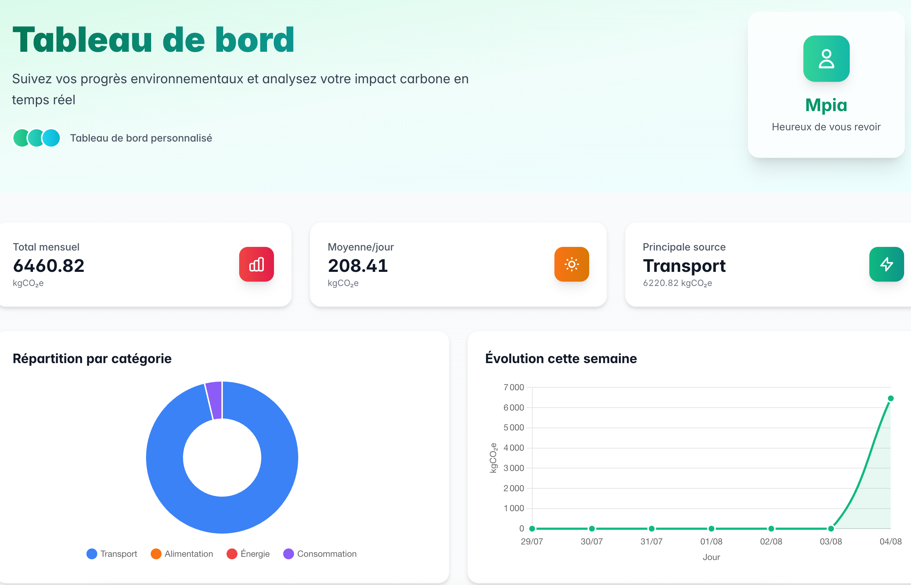

# EcoTrace - Calculateur d'Empreinte Carbone Personnelle


## 📋 Description

EcoTrace est une application web permettant aux utilisateurs de calculer, suivre et réduire leur empreinte carbone personnelle à travers l'enregistrement d'activités quotidiennes (transport, alimentation, consommation d'énergie). Ce projet a été développé dans le cadre d'un projet universitaire par des étudiants en L2 Informatique à l'Université Paris 8.



## ✨ Fonctionnalités principales

### 🧮 Calculateur d'empreinte carbone
- Interface pour saisir les activités quotidiennes et leurs quantités
- Base de données de facteurs d'émission pour différentes activités
- Algorithme de calcul additif
- Calcul automatique de l'impact carbone en temps réel

### 📊 Suivi des progrès
- Tableau de bord visuel montrant l'évolution de l'empreinte carbone
- Visualisations par jour/semaine/mois
- Répartition des émissions par catégorie

### 💡 Recommandations personnalisées
- Suggestions adaptées au profil d'émission de l'utilisateur
- Conseils pratiques pour réduire l'empreinte carbone
- Estimation des économies potentielles de CO2 par action

## 🛠️ Technologies utilisées

- **Backend**: Python 3.9+, Flask 2.0+, architecture MVC, programmation orientée objet
- **Frontend**: HTML5, CSS3 (Bootstrap ou TailwindCSS), JavaScript, Chart.js/Apexcharts.js
- **Base de données**: SQLite avec SQLAlchemy (ORM)
- **Données**: ADEME (facteurs d'émission CO2)
- **Déploiement**: Instructions fournies pour environnement local

## 🚀 Installation et configuration

### Prérequis
- Python 3.9 ou supérieur
- Git
- Navigateur web moderne

### Installation

1. Clonez ce dépôt
```bash
git clone https://github.com/votre-utilisateur/ecotrace.git
cd ecotrace
```

2. Créez un environnement virtuel et activez-le
```bash
# Sur Windows
python -m venv venv
venv\Scripts\activate

# Sur macOS/Linux
python3 -m venv venv
source venv/bin/activate
```

3. Installez les dépendances
```bash
pip install -r requirements.txt
```
4. Lancez l'application (Développement)
```bash
python3 run_app.py 
```

Dans un autre terminal pour vite (tailwindcss)

```bash
export FLASK_APP=run_app.py

flask vite init
flask vite install
flask vite start 
```

5. Ouvrez votre navigateur à l'adresse `http://localhost:5000`

## 📁 Structure du projet

```
.
├── assets
│   ├── static
│   │   ├── css
│   │   └── js
│   └── templates
│       ├── auth
│       │   ├── dashboard.html
│       │   ├── login.html
│       │   └── register.html
│       ├── carbon
│       │   ├── add_activity.html
│       │   ├── history.html
│       │   └── index.html
│       ├── errors
│       │   ├── 404.html
│       │   └── 500.html
│       └── partials
│           ├── base.html
│           ├── footer.html
│           ├── header.html
│           └── macro.html
├── auth
│   ├── __init__.py
│   ├── apps.py
│   ├── forms.py
│   ├── models.py
│   └── views.py
├── carbon
│   ├── __init__.py
│   ├── apps.py
│   ├── forms.py
│   ├── models.py
│   └── views.py
├── configs
│   ├── __init__.py
│   ├── errors.py
│   ├── filters.py
│   ├── processors.py
│   ├── settings.py
│   └── utils.py
├── controllers
│   ├── calculator.py
│   └── recommentation.py
├── LICENSE
├── README.md
├── requirements.txt
└── run_app.py
```

## 📝 Utilisation

1. **Créez un compte utilisateur** ou connectez-vous
2. **Ajoutez vos activités quotidiennes** dans les différentes catégories (transport, alimentation, etc.)
3. **Consultez votre tableau de bord** pour voir votre empreinte carbone
4. **Explorez les recommandations** pour réduire votre impact environnemental
5. **Suivez vos progrès** au fil du temps

## 🗺️ Roadmap

- [x] Définition de la stucture de l'application ecotrace
- [ ] 
- [ ] 
- [ ] 
- [ ] 

## 👥 Contributeurs

- PULUDISU Mpia Mimpiya - [GitHub](https://github.com/codewithmpia) - [Email](mailto:mpia-mimpiya.puludisu02@etud.univ-paris8.fr)


## 💬 Contribuer

Nous accueillons favorablement les contributions à ce projet. Pour contribuer :

1. Forkez le projet
2. Créez votre branche de fonctionnalité (`git checkout -b feature/amazing-feature`)
3. Committez vos changements (`git commit -m 'Add some amazing feature'`)
4. Pushez vers la branche (`git push origin feature/amazing-feature`)
5. Ouvrez une Pull Request

## 📚 Documentations

- [Flask](https://flask.palletsprojects.com/)
- [Flask-Admin](https://flask-admin.readthedocs.io/)
- [Flask-Login](https://flask-login.readthedocs.io/)
- [Flask-Migrate](https://flask-migrate.readthedocs.io/)
- [Flask-WTF](https://flask-wtf.readthedocs.io/)
- [flask-vite](https://pypi.org/project/flask-vite/)
- [TailwindCSS](https://tailwindcss.com/)
- [Chart.js](https://www.chartjs.org/)
- [Flask-Minify](https://pypi.org/project/Flask-Minify/)
- [Lucide Icons](https://lucide.dev/)

## 📄 Licence

Ce projet est distribué sous licence MIT. Voir le fichier `LICENSE` pour plus d'informations.

## 🙏 Remerciements

- [ADEME](https://www.ademe.fr/) pour les données sur les facteurs d'émission
- Université Paris 8 pour le cadre pédagogique
- Tous les contributeurs open source des bibliothèques utilisées

---

Projet développé dans le cadre du cours Réalisation du Programme - L2 Informatique - Université Paris 8

